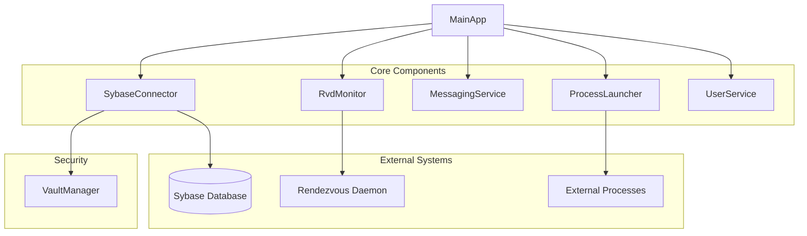
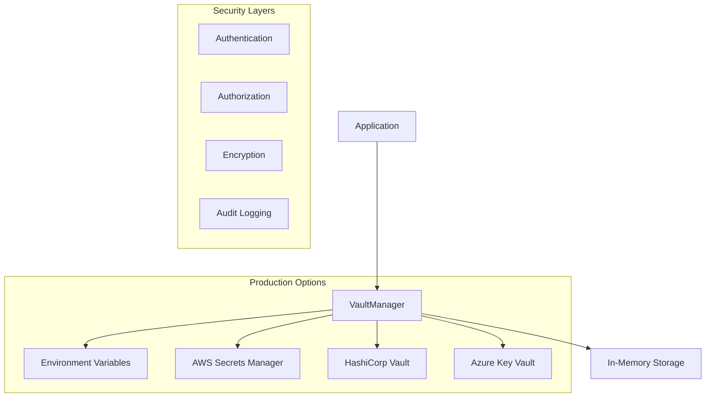

# ProcessMonitorMessenger - Architectural Diagram

## Component Overview

## Component Description

1. **MainApp**: The entry point of the application that initializes and orchestrates all services.

2. **ProcessLauncher**: Handles launching and monitoring external processes.

3. **SybaseConnector**: Manages connections to Sybase database using securely stored credentials from the vault.

4. **MessagingService**: Provides messaging capabilities for inter-service communication.

5. **RvdMonitor**: Monitors the Rendezvous Daemon (RVD) for system health checks.

6. **UserService**: Manages user authentication, registration, and user-related operations.

7. **VaultManager**: Secure vault implementation for managing sensitive credentials and secrets.

## Security Architecture

## Technology Stack

- Java 11
- Maven for dependency management
- Sybase database for data storage
- TIBCO Rendezvous for messaging
- JUnit and Mockito for testing
