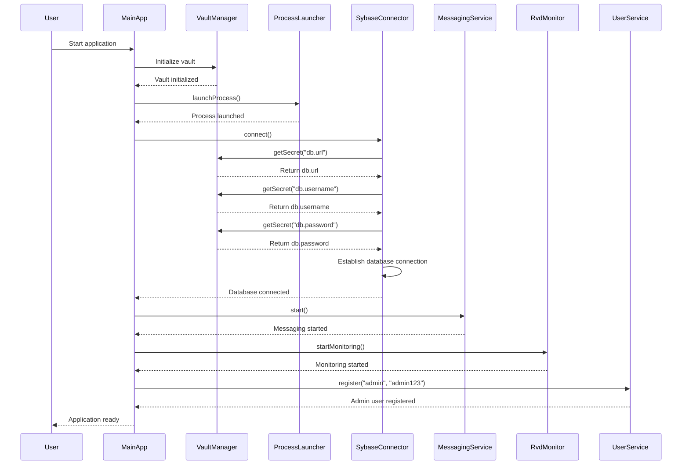
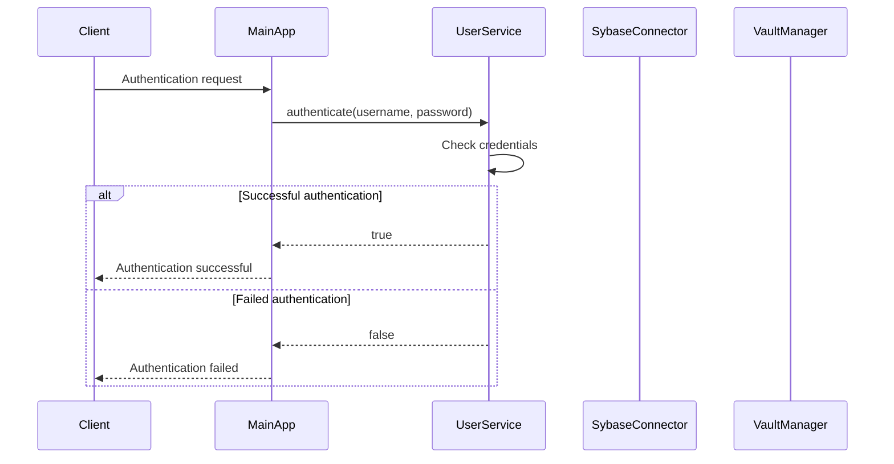
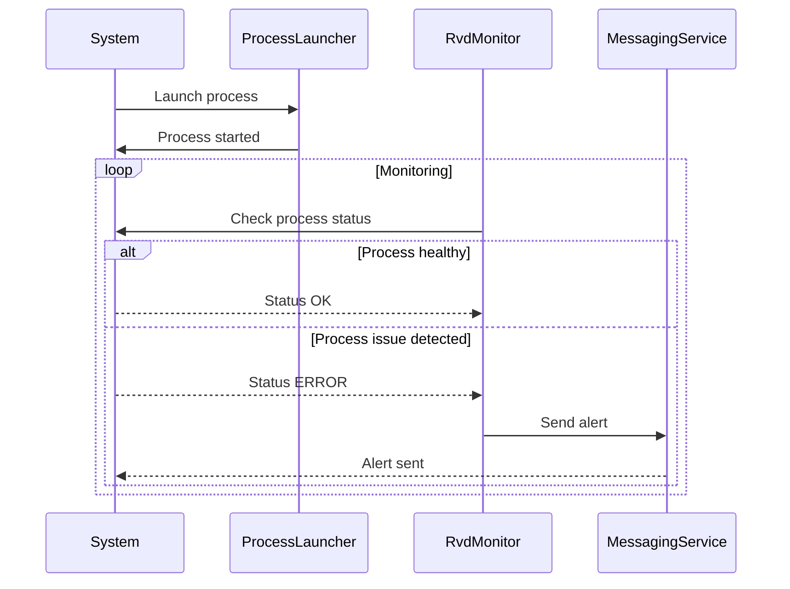
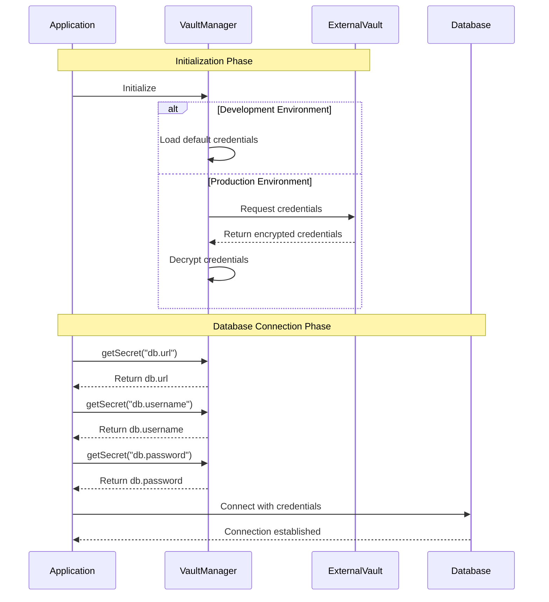

# ProcessMonitorMessenger - Flow Diagram

## Application Startup Flow

```mermaid
sequenceDiagram
    participant User
    participant MainApp
    participant VaultManager
    participant ProcessLauncher
    participant SybaseConnector
    participant MessagingService
    participant RvdMonitor
    participant UserService
    
    User->>MainApp: Start application
    MainApp->>VaultManager: Initialize vault
    VaultManager-->>MainApp: Vault initialized
    
    MainApp->>ProcessLauncher: launchProcess()
    ProcessLauncher-->>MainApp: Process launched
    
    MainApp->>SybaseConnector: connect()
    SybaseConnector->>VaultManager: getSecret("db.url")
    VaultManager-->>SybaseConnector: Return db.url
    SybaseConnector->>VaultManager: getSecret("db.username")
    VaultManager-->>SybaseConnector: Return db.username
    SybaseConnector->>VaultManager: getSecret("db.password")
    VaultManager-->>SybaseConnector: Return db.password
    SybaseConnector->>SybaseConnector: Establish database connection
    SybaseConnector-->>MainApp: Database connected
    
    MainApp->>MessagingService: start()
    MessagingService-->>MainApp: Messaging started
    
    MainApp->>RvdMonitor: startMonitoring()
    RvdMonitor-->>MainApp: Monitoring started
    
    MainApp->>UserService: register("admin", "admin123")
    UserService-->>MainApp: Admin user registered
    
    MainApp-->>User: Application ready
```

## User Authentication Flow

```mermaid
sequenceDiagram
    participant Client
    participant MainApp
    participant UserService
    participant SybaseConnector
    participant VaultManager
    
    Client->>MainApp: Authentication request
    MainApp->>UserService: authenticate(username, password)
    UserService->>UserService: Check credentials
    
    alt Successful authentication
        UserService-->>MainApp: true
        MainApp-->>Client: Authentication successful
    else Failed authentication
        UserService-->>MainApp: false
        MainApp-->>Client: Authentication failed
    end
```

## Process Monitoring Flow

```mermaid
sequenceDiagram
    participant System
    participant ProcessLauncher
    participant RvdMonitor
    participant MessagingService
    
    System->>ProcessLauncher: Launch process
    ProcessLauncher->>System: Process started
    
    loop Monitoring
        RvdMonitor->>System: Check process status
        
        alt Process healthy
            System-->>RvdMonitor: Status OK
        else Process issue detected
            System-->>RvdMonitor: Status ERROR
            RvdMonitor->>MessagingService: Send alert
            MessagingService-->>System: Alert sent
        end
    end
```

## Secure Credential Management Flow

```mermaid
sequenceDiagram
    participant Application
    participant VaultManager
    participant ExternalVault
    participant Database
    
    Note over Application,ExternalVault: Initialization Phase
    
    Application->>VaultManager: Initialize
    
    alt Development Environment
        VaultManager->>VaultManager: Load default credentials
    else Production Environment
        VaultManager->>ExternalVault: Request credentials
        ExternalVault-->>VaultManager: Return encrypted credentials
        VaultManager->>VaultManager: Decrypt credentials
    end
    
    Note over Application,Database: Database Connection Phase
    
    Application->>VaultManager: getSecret("db.url")
    VaultManager-->>Application: Return db.url
    Application->>VaultManager: getSecret("db.username")
    VaultManager-->>Application: Return db.username
    Application->>VaultManager: getSecret("db.password")
    VaultManager-->>Application: Return db.password
    
    Application->>Database: Connect with credentials
    Database-->>Application: Connection established
```
